# Milestone project 1 - Chris Pomeroy Music

My goal for this project is to create a business to customer-based website aimed at users who would like to book an entertainer for their wedding or function. Grabbing a users attention with media combined with a simple layout that is consistent throughout the pages. With these targets in mind, I hope to capture the users attention and make it easy for them to end up at the booking page.

# Balsamiq wireframe

To begin with, I will make Balsamiq wireframes for both desktop and mobile viewports so that I can plan the layouts of both. I would like both viewports to look sleek and consistent while still maintaining the planned goal across all devices.

To design the mobile wireframes, I want to centralize things more and have the navigation menu change to a more compact dropdown-style menu.

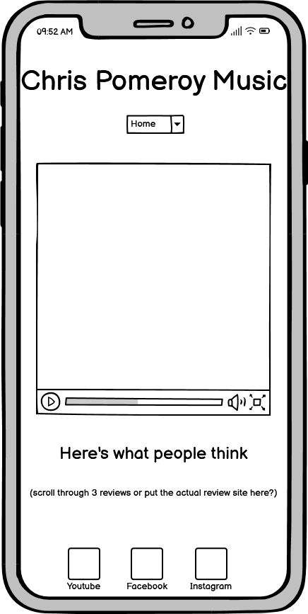
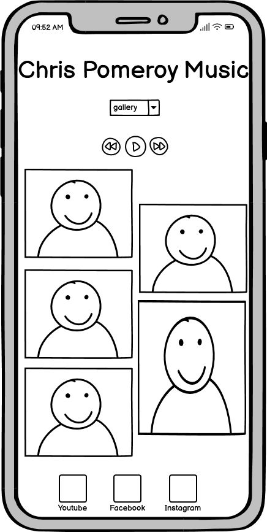
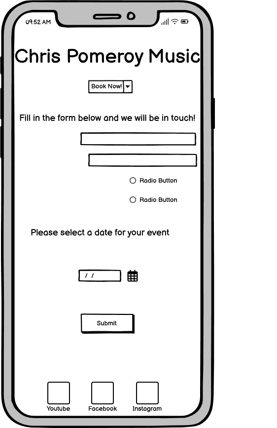

# Basic layout

once I'm happy with my Wireframes, I create a basic boilerplate and link my stylesheet to my index page. I chose Ubuntu as my prefered font and included sans-serif as a websafe font. I chose Ubuntu because it is quirky and eye-catching while being solid and readable.

I create my basic html pages 'Home', 'Gallery' and 'Contact Me!' then lay out my logo and basic list navigation bar. I am then able to link up the pages so that the navigation is functioning. I apply some styling to both the logo and navigation bar to get them sitting neatly at the top of the pages.

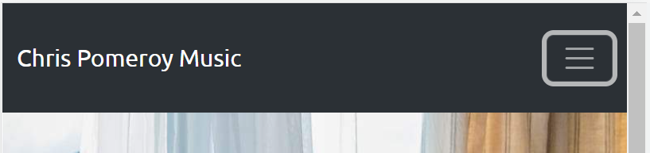

After a very productive meeting with my mentor, I decide to move away from manually laying out my page. Instead I will re-work my navigation bar and logo using bootstrap. I have made this decision because I feel it will benefit my responsive design throughout the project.

# Home Page

The home page begins with a header which includes the navigation bar and my logo in slightly larger font. In the mobile viewport, The navigation bar condenses into a neat dropdown menu to access navigation. I have opted for a dark slate grey and black colour scheme because I think it looks neat and classy. This colour scheme also contrasts with the home page hero image which makes it pop out of the page. I have also added an audio player into the header with me singing to give the user a better idea of what I sound like. In the wireframes I had put the audio player in the gallery, but I have now decided to put it on the home page because I believe users will spend more time there reading through the quotes than looking at the images in the gallery. Users will need to play it manually as I don't want to force them to listen. I am not totally happy with the positioning of the audio player, so I will come back to it later. I customized the header and footer to have a linear-gradient to smooth out the pages and add an attractive twist to the website.

I have used logos from fontawesome to build my footer which includes links to my socials Youtube, Facebook and Instagram.

# Gallery Page

I want the gallery page to be very simple, showcasing some action photos of me performing. As shown in the wireframes, I want the media to be shown in a masonry style using bootstrap to help with the responsiveness. The pictures should be big and bold on desktop, and then condensed into a column of photos on the mobile viewport. The Gallery page will have the social media buttons at the bottom of the page being conistent across all pages, so that the user can click on them at any point which will take them to my socials in a different tab. I have done this so that they don't lose my website page, I want them to be able to come back to the website easily so that they can navigate to the Contact page.

# Contact page

I have laid out the contact page with a large hero image that doesn't distract the user too much from the form, in which I will lay the contact form on top of. I want my face to sit to one side with the form next to it. I want this page to be clean and uncluttered because I want the user's focus to be on the form.

# Confirmation page

The fields 'Email address' and 'Tell us the type of event!' are set to be required because these are vital pieces of information needed to process a users information and needs. i have included an optional field for other details in case the user would like to provide extra information. Once the user clicks submit, They will be taken to a confirmation page so that the user is happy their submission has been sent. After 10 seconds the user is redirected back to the home page. I have added the header and footer socials to the footer page to keep it consistent with the website.

# Testing

## HTML

For my html testing, I have used URL input into https://validator.w3.org/.

### index.html

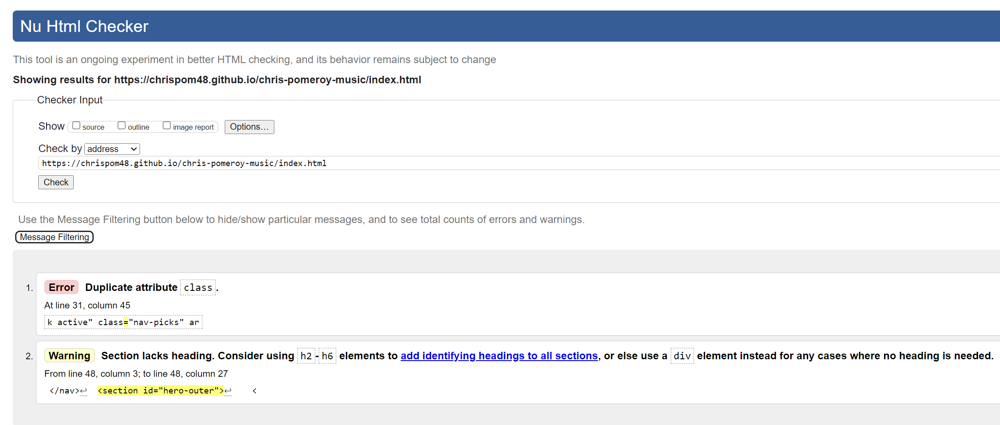

1. I fixed the error by merging the two class attributes into one.
2. I do not believe I need a header or div element here.

### gallery.html

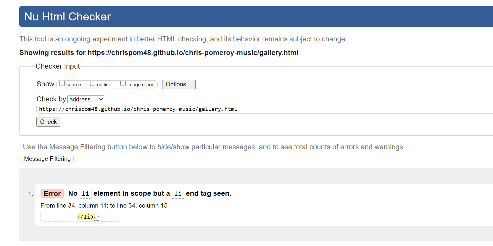

1. I fixed this error by moving the List closing tags immediately after each List opening tag and its contents.

### contact.html

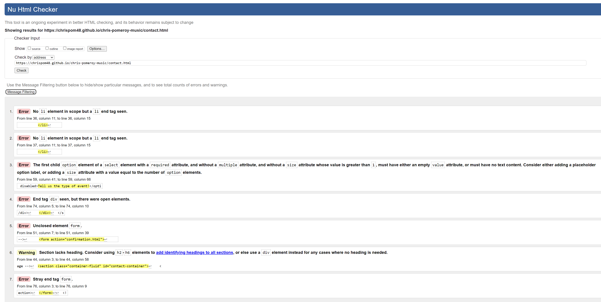

1. I fixed this error by moving the List closing tags immediately after each List opening tag and its contents.
2. I fixed this error by moving the List closing tags immediately after each List opening tag and its contents.
3. I fixed this error by adding an empty value attribute.
4. I fixed this error by moving the elements around and making sure all div elements had opening and closing tags.
5. I fixed this error by adding a closing tag to the form element.
6. I do not believe I need a header or div element here.
7. I fixed this error by adjusting the position of the form closing tag.

### confirmation.html

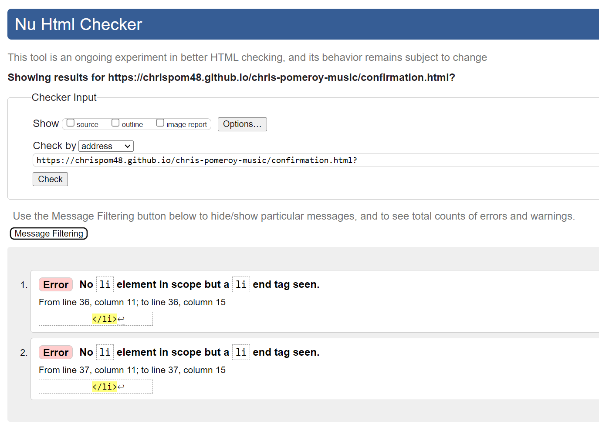

1. I fixed this error by moving the List closing tags immediately after each List opening tag and its contents.
2. I fixed this error by moving the List closing tags immediately after each List opening tag and its contents.

## CSS

For my CSS stylesheet testing, I have used direct input into https://jigsaw.w3.org/css-validator/.

### style.css

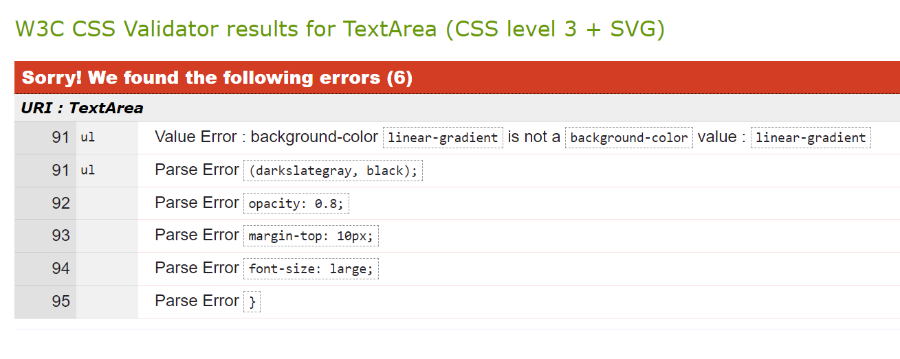

1. I fixed this error by changing 'background-color' to 'background-image', This in turn fixed all Parse errors.

## Responsiveness

To test responsiveness, I have created two tables that include information about my responsivess testing techniques. Table 1 shows testing results of responsiveness towards different viewports, and table 2 shows results of responsiveness towards a selection of popular browsers.

### Table 1

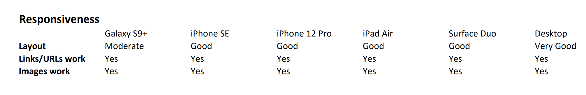

The table shows a good responsivess towards different devices, although when the viewport gets as small as a Galaxy S9+, The header and footer become slightly cluttered and squeezed. In summary, the responsiveness between mobile, tablet and desktop is excellent. Having a three column theme on desktop, two columns on tablet and condensing to a single column on mobile.

### Table 2

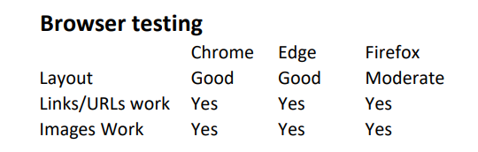

I used Google Chrome as my default browser throughout the project, so The site looks great on it. I chose to use google chrome because I find the DevTools it provides very helpful when testing responsiveness and finding bugs.

Microsoft Edge was similar to Google Chrome in that everything seems to be working well, with no noticeable differences to the site.

I encountered a slight change when testing on Mozilla Firefox in that it outs a small section of background underneath the footer which is not present in the other two browsers.

# Future Improvements

In the future, I hope to add a video player showcasing me on stage performing. I did not add this to my minimum viable product because I don't want to clutter the inital website, I could not find a tidy place for it to sit so I decided to leave it out. Too much information for the user can be overwhelming so I have opted for the 'less is more' approach for now.

# Deployment

In the GitHub repository https://github.com/Chrispom48/chris-pomeroy-music, navigate to the Settings tab 
- From the pages section, select the **Main** Branch, then click "Save".
- The page will be automatically refreshed with a detailed ribbon display to indicate the successful deployment and live site.

The site has been deployed to GitHub Pages. The live link to the website can be found here:

https://chrispom48.github.io/chris-pomeroy-music/

## Cloning

You can clone the repository by following these steps:

1. Go to the [GitHub repository](https://github.com/Chrispom48/chris-pomeroy-music) 
2. Locate the Code button above the list of files and click it 
3. Select if you prefer to clone using HTTPS, SSH, or GitHub CLI and click the copy button to copy the URL to your clipboard
4. Open Git Bash or Terminal
5. Change the current working directory to the one where you want the cloned directory
6. In your IDE Terminal, type the following command to clone my repository:
	- `git clone https://github.com/Chrispom48/chris-pomeroy-music.git`
7. Press Enter to create your local clone.

Alternatively, if using Gitpod, you can click below to create your own workspace using this repository.

Please note that in order to directly open the project in Gitpod, you need to have the browser extension installed.
A tutorial on how to do that can be found [here](https://www.gitpod.io/docs/configure/user-settings/browser-extension).

# Credits

For guidance on parts of my project I used https://www.w3schools.com/default.asp to help with building and fixing bugs.

For my footer icons, I used Fontawesome kits:
https://fontawesome.com/icons/youtube?f=brands&s=solid
https://fontawesome.com/icons/instagram?f=brands&s=solid
https://fontawesome.com/icons/facebook?f=brands&s=solid

As well as using **w3schools** for guidance, I also had help from my mentor **Tim Nelson** and want to thank him for guiding me through the steps of this project and answering a plethora of my questions.

for README and testing help, I used Tim Nelson's [Markdown Builder](https://traveltimn.github.io/markdown-builder). 

