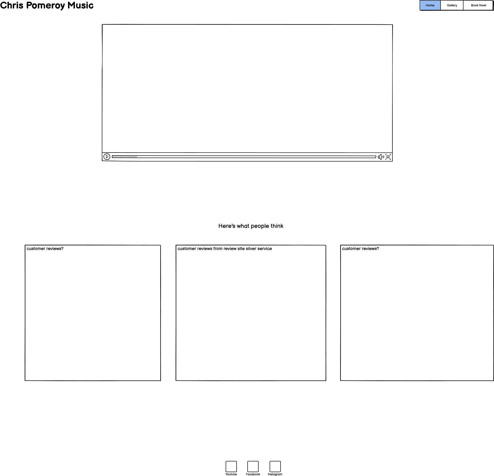

## Milestone project 1 - Chris Pomeroy Music

My goal for this project is to create a business to customer-based website aimed at users who would like to book an entertainer for their wedding or function. Grabbing a users attention with media combined with a simple layout that is consistent throughout the pages. With these targets in mind, I hope to capture the users attention and make it easy for them to end up at the booking page.

## Balsamiq wireframe

TO begin with, I will make Balsamiq wireframes for both desktop and mobile viewports so that I can plan the layouts of both. I would like both viewports to look sleek and consistent while still maintaining the planned goal across all devices.

## Basic layout

once I'm happy with my Wireframes, I create a basic boilerplate and link my stylesheet to my index page. I chose Ubuntu as my prefered font and included sans-serif as a websafe font. I chose Ubuntu because it is quirky and eye-catching while being solid and readable.

I create my basic html pages 'Home', 'Gallery' and 'Contact Me!' then lay out my logo and basic list navigation bar. I am then able to link up the pages so that the navigation is functioning. I apply some styling to both the logo and navigation bar to get them sitting neatly at the top of the pages.

After a very productive meeting with my mentor, I decide to move away from manually laying out my page. Instead I will re-work my navigation bar and logo using bootstrap. I have made this decision because I feel it will benefit my responsive design throughout the project.

1. Log in to your Heroku account and go to *Account Settings* in the menu under your avatar.
2. Scroll down to the *API Key* and click *Reveal*
3. Copy the key
4. In Gitpod, from the terminal, run `heroku_config`
5. Paste in your API key when asked

