## Milestone project 1 - Chris Pomeroy Music

My goal for this project is to create a business to customer-based website aimed at users who would like to book an entertainer for their wedding or function. Grabbing a users attention with media combined with a simple layout that is consistent throughout the pages. With these targets in mind, I hope to capture the users attention and make it easy for them to end up at the booking page.

## Balsamiq wireframe

TO begin with, I will make Balsamiq wireframes for both desktop and mobile viewports so that I can plan the layouts of both. I would like both viewports to look sleek and consistent while still maintaining the planned goal across all devices.

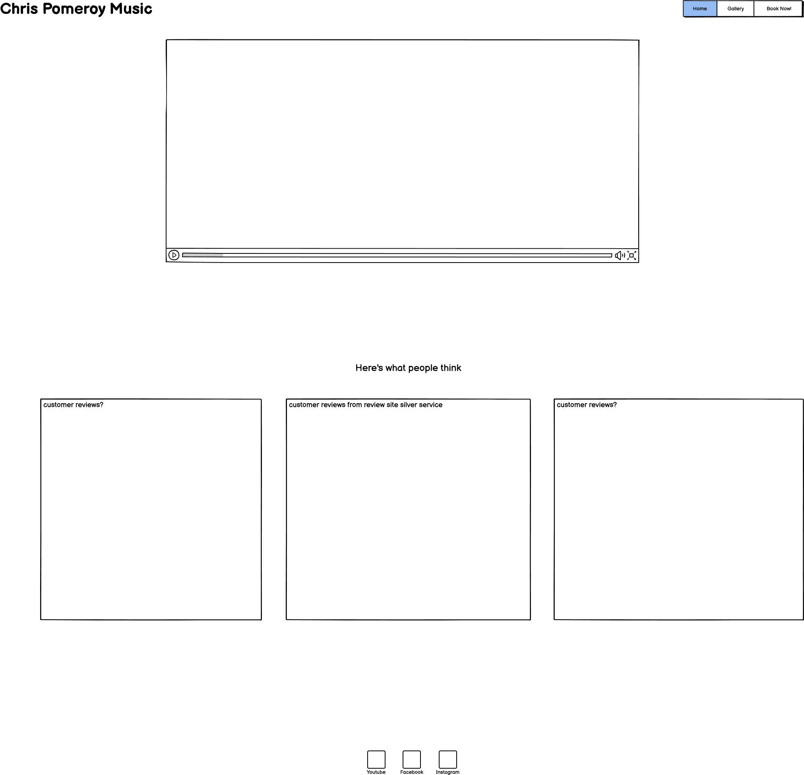
 
 
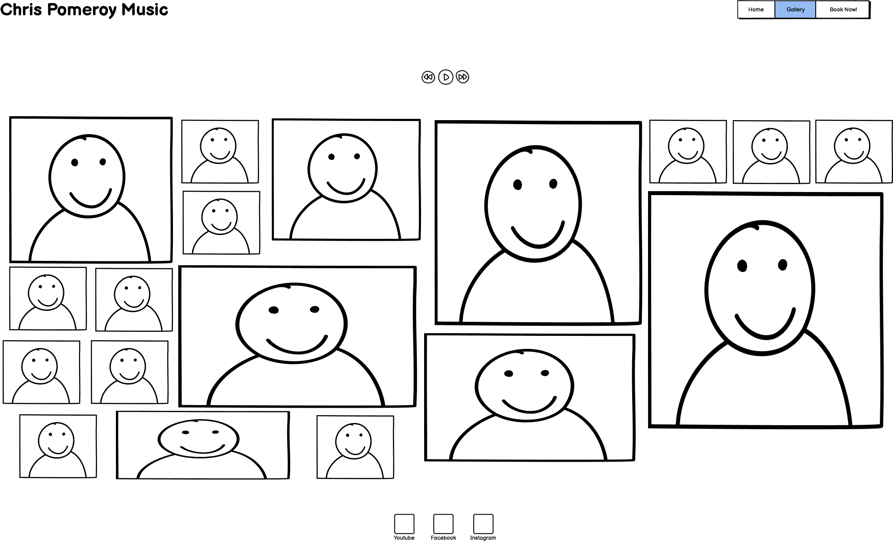
 
 
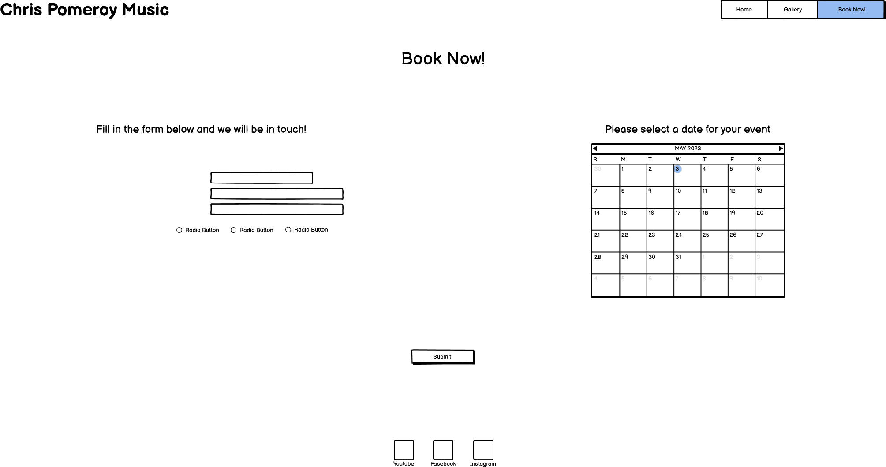

 
 
To design the mobile wireframes, I want to centralize things more and have the navigation menu change to a more compact dropdown-style menu.
 
 
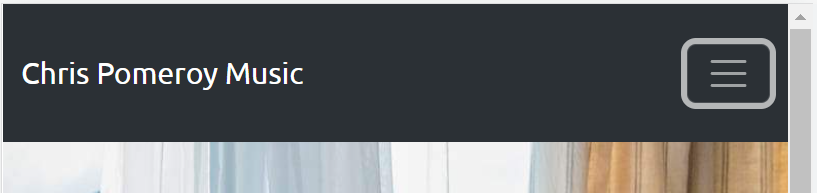
 
 

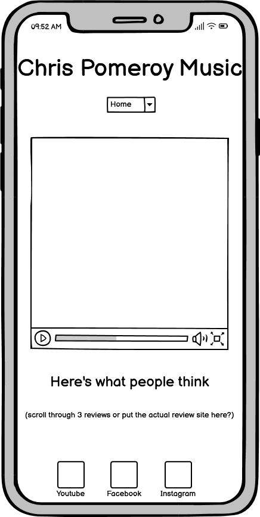
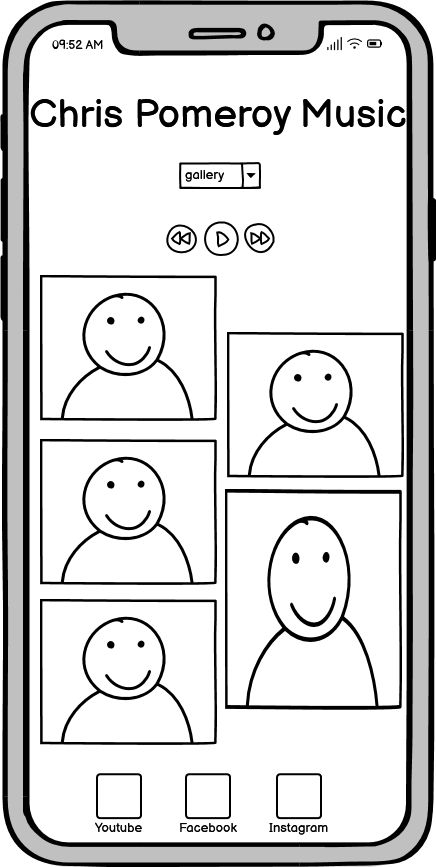
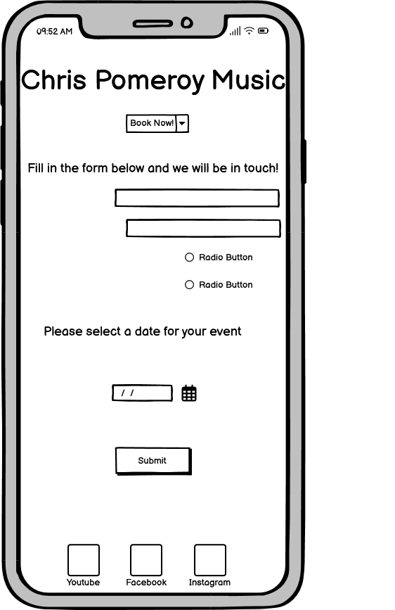

## Basic layout

once I'm happy with my Wireframes, I create a basic boilerplate and link my stylesheet to my index page. I chose Ubuntu as my prefered font and included sans-serif as a websafe font. I chose Ubuntu because it is quirky and eye-catching while being solid and readable.

I create my basic html pages 'Home', 'Gallery' and 'Contact Me!' then lay out my logo and basic list navigation bar. I am then able to link up the pages so that the navigation is functioning. I apply some styling to both the logo and navigation bar to get them sitting neatly at the top of the pages.
 
 
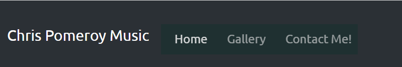

After a very productive meeting with my mentor, I decide to move away from manually laying out my page. Instead I will re-work my navigation bar and logo using bootstrap. I have made this decision because I feel it will benefit my responsive design throughout the project.

## Home Page

The home page begins with a header which includes the navigation bar and my logo in slightly larger font. In the mobile viewport, The navigation bar condenses into a neat dropdown menu to access navigation. I have also added an audio player into the header with me singing to give the user a better idea of what I sound like. In the wireframes I had put the audio player in the gallery, but I have now decided to put it on the home page because I believe users will spend more time there reading through the quotes than looking at the images in the gallery. Users will need to play it manually as I don't want to force them to listen. I am not totally happy with the positioning of the audio player, so I will come back to it later.
 
 
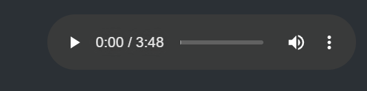

## Gallery Page

I want the gallery page to be very simple, showcasing some action photos of me performing. As shown in the wireframes, I want the media to be shown in a masonry style using bootstrap to help with the responsiveness. The pictures should be big and bold on desktop, and then condensed into a column of photos on the mobile viewport. The Gallery page will have the social media buttons at the bottom of the page being conistent across all pages, so that the user can click on them at any point which will take them to my socials in a different tab. I have done this so that they don't lose my website page, I want them to be able to come back to the website easily so that they can navigate to the Contact page.
 
 
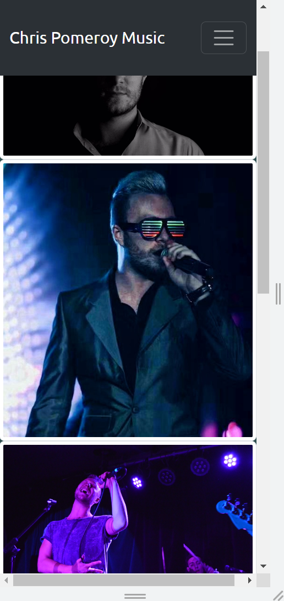

## Contact page

I have laid out the contact page with a large hero image that doesn't distract the user too much from the form, in which I will lay the contact form on top of. I want my face to sit to one side with the form next to it. I want this page to be clean and uncluttered because I want the user's focus to be on the form.

## Confirmation page

The fields 'Email address' and 'Tell us the type of event!' are set to be required because these are vital pieces of information needed to process a users information and needs. i have included an optional field for other details in case the user would like to provide extra information. Once the user clicks submit, They will be taken to a confirmation page so that the user is happy their submission has been sent. After 10 seconds the user is redirected back to the home page. I have added the header and footer socials to the footer page to keep it consistent with the website.
 
 
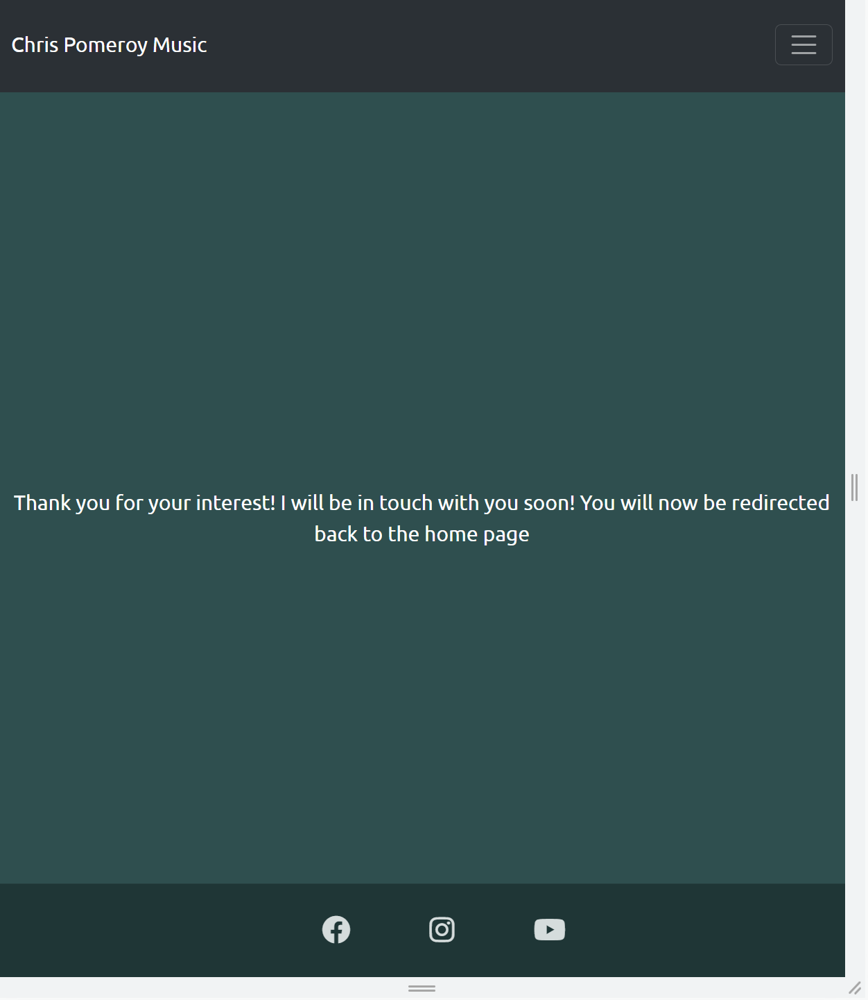

